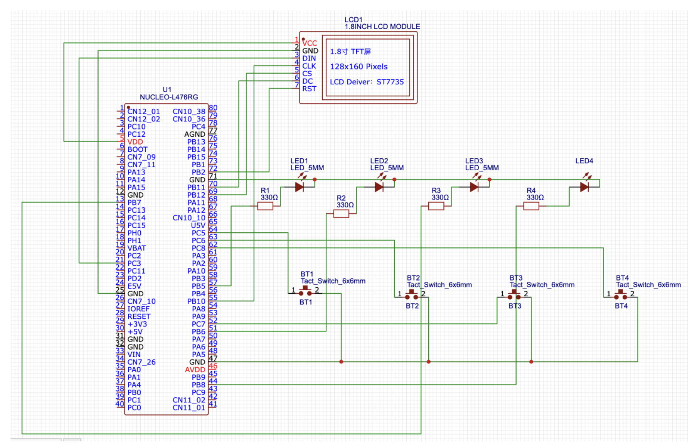
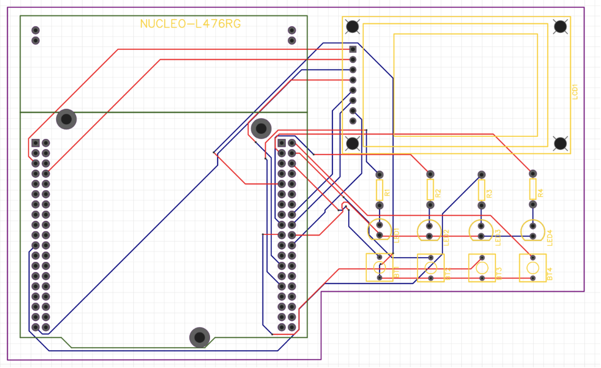

# Simon Says Game

Simon Says Game - An STM32CubeIDE project implementing a classic Simon Says memory game with LED sequences, multi-player support, and ranking systems. Developed as a project for the Computer Architecture course at Bialystok University of Technology. Documentation is available in both Polish and English.

## Project Overview

- **Game Description:**  
  A Simon Says game where players must memorize and repeat a sequence of LED signals. The difficulty increases with each level.

- **Features:**
  - Random sequence generation for LED signals.
  - Support for multiple players (up to 4), with username input via UART.
  - LCD-based menu system for game navigation and rankings.
  - Global and session ranking systems.

## Documentation

- **Polish Documentation:**  
  [Projekt zaliczeniowy AK LAB - Kondrat Ochrymiuk.pdf](./Projekt%20zaliczeniowy%20AK%20LAB%20-%20Kondrat%20Ochrymiuk.pdf)

- **English Documentation (automatically translated):**  
  [Final project CA LAB - Kondrat Ochrymiuk.pdf](./Final%20project%20CA%20LAB%20-%20Kondrat%20Ochrymiuk.pdf)

## Electronic Schematic and PCB Layout

This section provides a detailed view of the hardware design for the Simon Says game, including the complete electronic schematic and the corresponding PCB layout.

### Electronic Schematic

The schematic diagram below illustrates the circuit design, including the microcontroller, LED drivers, button interfaces, and LCD connections used in the project.

### PCB Layout

The PCB layout shown below represents the final board design. It details the placement of components and the routing of connections necessary to implement the circuit.

## Gerber Files

The complete set of Gerber files for PCB fabrication is provided as a single ZIP archive in the repository. This archive contains all the necessary layers for manufacturing the PCB, including copper, solder mask, silkscreen, and drill files.

Simply download and extract the [gerber.zip](./gerber.zip) file to access the individual Gerber files.

## Repository Structure

- **simon/**  
  Contains the STM32CubeIDE project files.

- Documentation and design files (schematic, PCB and gerber files) are located in the repository root.